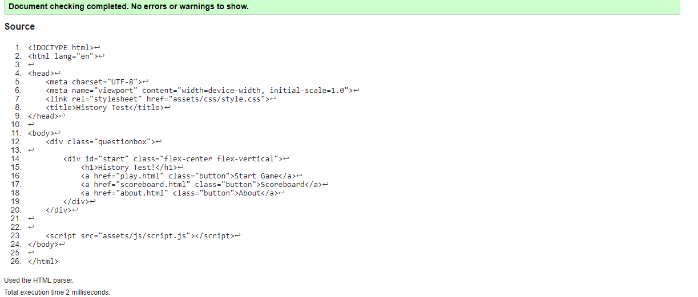
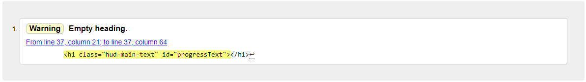
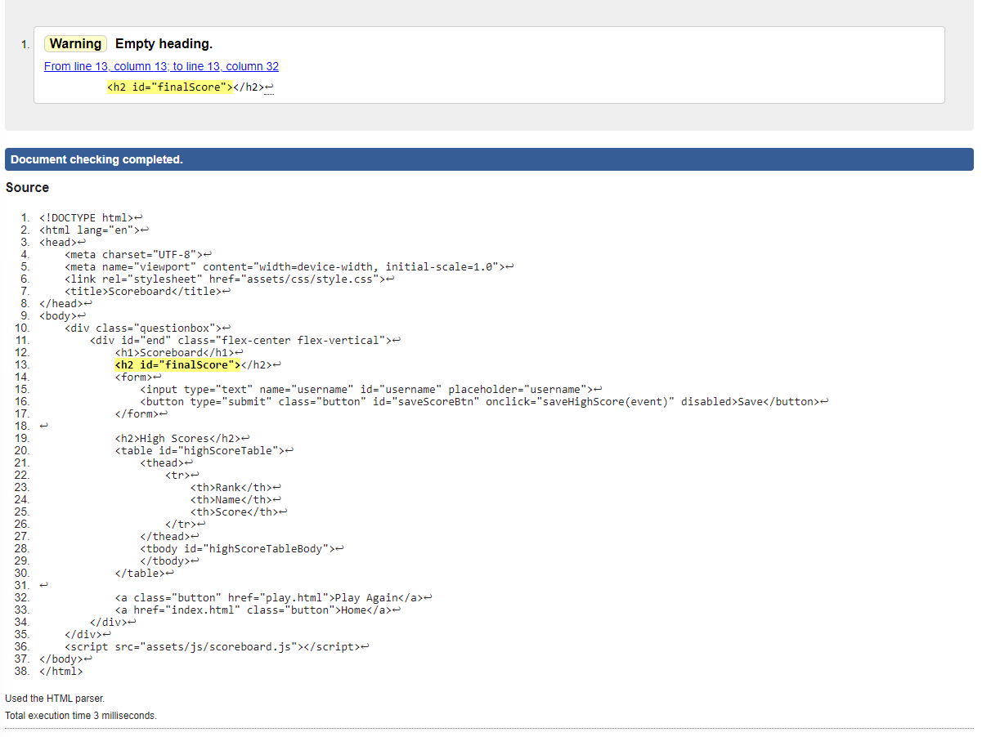
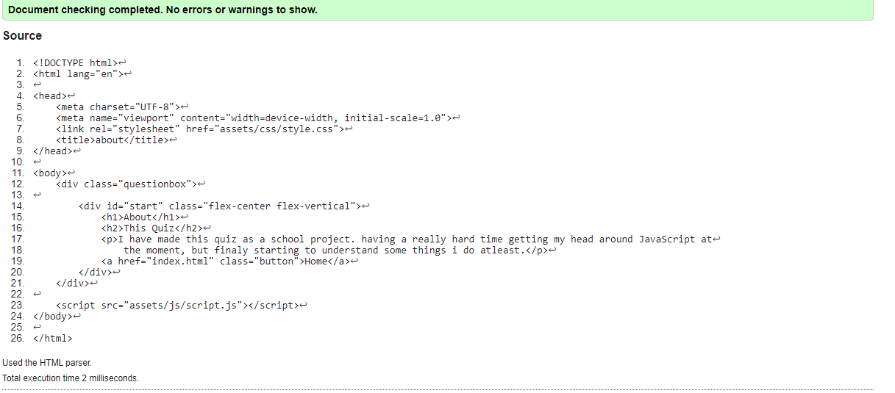
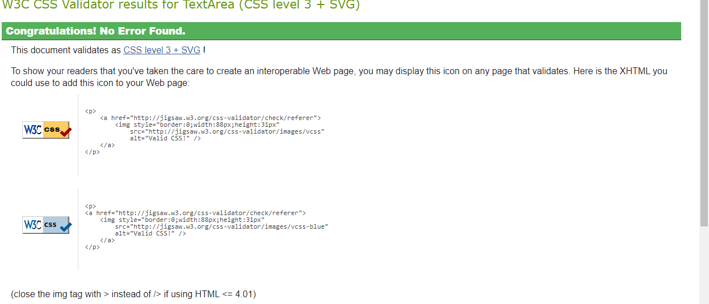

# Quiz Website

## Overview

This is a simple HTML and JavaScript-based quiz application that allows users to test their knowledge on histoy. The application presents multiple-choice questions, tracks the user's score, and displays a scoreboard with the top scores.

## Features

- Multiple-choice questions with four answer options.
- Score tracking for correct answers.
- Progress bar indicating the number of questions answered.
- High score leaderboard to save and display the top scores.
- Responsive design for a better user experience on different devices.

## Technologies Used

- HTML
- CSS
- JavaScript

## How to Use

- Click the "Start Quiz" button on the home page to begin.
- Answer the questions by clicking on one of the answer options.
- Your score will be updated based on your answers.
- After answering all questions, you'll be redirected to the scoreboard page where you can enter your name to save your score.

## Validating and testing

### Index Page Validation

### Play Page Validation

### Scoreboard Page Validation

### About Page Validation

### Style.css Validation

### Google Developer Tools

## Bugs and Errors
- JavaScript errors that i dont understand and are still trying to figure out how to fix
- The empty heading warnings wich i have tried to adress but made it worse so sticking with it for now. 